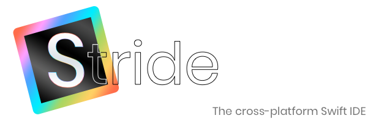

Stride is a cross-platform IDE for Swift development.  Stride is in the early stages of its development, but is useful and usable in its present state where alternatives are limited.  It's "self-hosting": you can edit, build and run Stride within itself.

As its project model Stride uses Swift packages, thereby providing first class support for Swift packages.  You simply open a Package.swift in Stride and your full package source will be shown, including any dependencies that have been set to "edit" mode via the Swift Package Manager.  This has not yet been extensively tested outside of Stride's own packages.

Stride uses a custom GUI toolkit called [Suit](https://github.com/pmacro/Suit), written from scratch in Swift, in order to provide a single consistent codebase and experience across platforms.  While only macOS and Linux are supported today, backends for other platforms are planned once things stabilize a little bit more.

## Building

Stride builds opened projects using the "swift build" command in the project root directory.  Improvements are planned in this area to allow for the customisation of the command's parameters, but in the meantime Stride will prefer a file named exactly "build.sh" over "swift build" if such a file exists in the project's root directory. This can be used if your project relies on additional parameters in its build.  Stride itself is built using such a file.  NB. if you provide a custom build.sh file, please ensure it exits with the appropriate status, since Stride uses this to determine whether the build succeeded or failed.  Take a look at Stride's own build.sh file for an example.

## Debugging

Debugging has not yet been implemented, but it is top of the list once the current feature set is stable and rounded out.

## Contributing

Your input is very much welcomed.  There's a lot to do, but you're getting involved at a time when you can have a major impact and influence on an exciting project.  Stride is developed hand-in-hand with Suit, a cross-platform Swift GUI toolkit, so you'll have to get your hands dirty there, too--but it'll be fun.

## How can I monitor Stride's progress

You can follow me on [Twitter](https://twitter.com/saniceadonut), where I post frequent progress updates for both Suit and Stride.  Hopefully the project will gain other contributors over time and I will no longer be a single contact point for the projects.

## Quick Start

If you're running on macOS, you simply need to pull down the repository, then:

    cd Stride
    swift package update
    ./build.sh
    swift run --skip-build

If you're running Linux, pull down the repository, then:

    cd Stride
    swift package edit Suit
    ./Packages/Suit/install_dependencies_ubuntu.sh
    swift package update
    ./build.sh
    swift run --skip-build

If you subsequently modify the source, then just build and run as you'd expect:

    ./build.sh
    swift run --skip-build
    
To run tests, you can either do so from inside the Xcode project, or use the included script:

    ./test.sh

When you first run Stride you will need to go into the Preferences and select the Swift compiler path and the path to the [sourcekit-lsp](https://github.com/apple/sourcekit-lsp) executable.  Stride includes pre-built binaries inside its "Language Servers" folder.  You can try these, but it's advised to build your own using your toolchain.

## Troubleshooting

The project is so new at this point that I don't know what issues users are likely to face.  The best thing to do is let me know and I'll respond ASAP.  I suspect that the most likely issues will be related to getting code completion to work and having Stride load arbitrary projects.  Please bear with me while any initial teething problems are worked out!

## State of the project

Note that a check doesn't indicate that a feature is fully complete and without bugs, it indicates that it exists in some form.  The main purpose of the below information is for someone to get a rough idea, at a glance, of where the project is.  Similarly, an item not being in the list at all doesn't mean it's not planned for the project, it just means it's not the current focus at this early stage.

- [x] Basic code completion
- [ ] Press tab to navigate to next/previous parameter after selecting code completion item.
- [x] Basic go to symbol.
- [ ] Choose from multiple possible locations for go to symbol
- [x] Quick open file.
- [x] Open Project - uses weird SPM interaction model, needs work.
- [ ] Create new file.
- [x] New Project (basic version)
- [ ] Debugger
- [x] Build output
- [x] Run output
- [x] Support multiple open files in tabs.
- [x] Show coding errors/warnings.
- [x] Build projects
- [x] Run projects
- [x] UI for compiler/LSP configuration
- [ ] Ensure code is not assuming Swift is the language being edited.

A large part of the work has been the implementation of an editor view, so it deserves its own task list.

- [x] Edit text
- [x] Cut/copy/paste
- [x] Select all
- [x] Replace selected text on edit
- [x] Arrow key navigation
- [x] Mouse selection
- [ ] Auto-scroll to caret location
- [x] Text attributes (such as color)
- [x] Acceptable performance editing very large files.
- [x] Optimised rendering (draw only changed parts of the file) - initial version, at least.
- [x] Handle non ascii content correctly, such as emojis. 
- [ ] Undo/redo